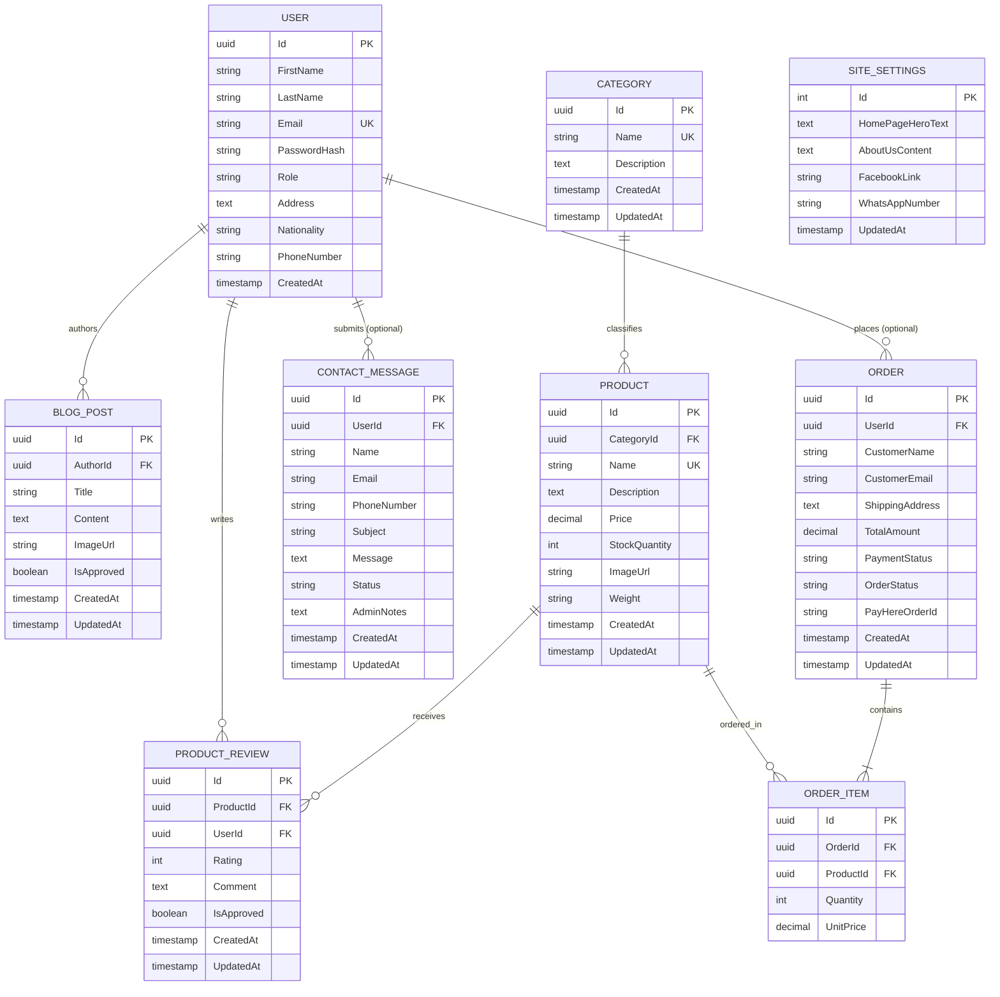

# Arboveya E-Commerce Platform — Comprehensive Backend & API Specification

> **Version:** 1.0.0  
> **Backend Framework:** ASP.NET Core (.NET 10)  
> **Database:** PostgreSQL (Neon Cloud / Local) with Entity Framework Core 9  
> **Security:** JWT (JSON Web Tokens) with BCrypt Password Hashing (Work Factor 12)  
> **Payment Gateway Target:** PayHere  

---

## Table of Contents
1. [User Roles & Access Levels](#1-user-roles--access-levels)
2. [Pages & Access Matrix](#2-pages--access-matrix)
3. [Entity-Relationship (ER) Diagram](#3-entity-relationship-er-diagram)
4. [Database Schema & Entity Specifications](#4-database-schema--entity-specifications)
5. [Complete API Endpoint Catalog](#5-complete-api-endpoint-catalog)
   - [5.1 Authentication & Profile](#51-authentication--profile-apiauth)
   - [5.2 Categories](#52-categories-apicategories)
   - [5.3 Products](#53-products-apiproducts)
   - [5.4 Product Reviews](#54-product-reviews-apireviews)
   - [5.5 Blog Posts](#55-blog-posts-apiblogposts)
   - [5.6 Orders & Checkout](#56-orders--checkout-apiorders)
   - [5.7 Dynamic Site Settings](#57-dynamic-site-settings-apisitesettings)
   - [5.8 Contact Inquiries](#58-contact-inquiries-apicontact)
   - [5.9 Admin Dashboard & User Management](#59-admin-dashboard--user-management-apiadmin)
6. [Standard HTTP Response & Error Codes](#6-standard-http-response--error-codes)

---

## 1. User Roles & Access Levels

| Role | Scope | Description & Permissions |
| :--- | :--- | :--- |
| **Guest** | Unregistered | Can browse catalog categories and products, read approved blog posts, view dynamic Home and About Us pages, add items to client cart, perform checkout with guest contact details, and submit contact inquiries. |
| **Customer** | Registered User | Inherits all Guest permissions plus: Authenticate via email & password, manage profile (nationality, address, telephone), view personal order history, submit product reviews (pending admin review), submit blog articles for review, and submit logged-in contact inquiries. |
| **Admin** | Administrator | Full management authority over the entire backend: Manage product catalog (CRUD), category hierarchy, track and update order & payment statuses, moderate product reviews, review/approve/publish user blog posts, manage dynamic website content (hero text, mission, social links), handle contact inbox, view registered users, and inspect executive dashboard metrics. |

---

## 2. Pages & Access Matrix

| Page / Route | Description | Access Level | Supporting API Endpoints |
| :--- | :--- | :---: | :--- |
| **`/` (Home)** | Dynamic hero text, featured products, social links | Public | `GET /api/sitesettings`<br>`GET /api/products` |
| **`/about`** | Company story, values, and mission | Public | `GET /api/sitesettings` |
| **`/shop`** | Product catalog filterable by category and keyword | Public | `GET /api/products`<br>`GET /api/categories` |
| **`/product/[id]`** | Single product detail view & approved user reviews | Public | `GET /api/products/{id}`<br>`GET /api/products/{id}/reviews` |
| **`/blog`** | Listing of published/approved blog posts | Public | `GET /api/blogposts` |
| **`/blog/[id]`** | Detailed view of a single approved blog post | Public | `GET /api/blogposts/{id}` |
| **`/blog/create`** | Form for registered users to submit new blog articles | Customer | `POST /api/blogposts` |
| **`/cart`** | User's shopping cart | Public | Client-side state + order validation |
| **`/login`** | User sign-in / authentication | Public | `POST /api/auth/login` |
| **`/signup`** | New user registration | Public | `POST /api/auth/register` |
| **`/profile`** | Customer dashboard to edit address, nationality & view orders | Customer | `GET /api/auth/me`<br>`PUT /api/auth/me`<br>`GET /api/orders/my-orders` |
| **`/checkout`** | Payment processing (integrated with PayHere) | Customer / Public | `POST /api/orders` |
| **`/contact`** | Contact Us inquiry form | Public | `POST /api/contact` |
| **`/admin` (Dashboard)** | Overview of sales, orders, and system metrics | Admin Only | `GET /api/admin/dashboard` |
| **`/admin/products`** | Product & category management (List, Add, Edit, Delete) | Admin Only | `POST, PUT, DELETE /api/products`<br>`POST, PUT, DELETE /api/categories` |
| **`/admin/orders`** | Order tracking and status management | Admin Only | `GET /api/orders`<br>`PUT /api/orders/{id}/status` |
| **`/admin/blog`** | Blog management (create own, edit, delete, approve submissions)| Admin Only | `GET /api/blogposts/admin/all`<br>`PUT /api/blogposts/{id}/moderation`<br>`DELETE /api/blogposts/{id}` |
| **`/admin/reviews`** | Moderation and management of user product reviews | Admin Only | `GET /api/reviews/admin/all`<br>`PUT /api/reviews/{id}/moderation`<br>`DELETE /api/reviews/{id}` |
| **`/admin/content`** | Manage Home Page text, About Us content, and Social Links | Admin Only | `PUT /api/sitesettings` |
| **`/admin/messages`** | Inbox for inquiries submitted via Contact Us form | Admin Only | `GET /api/contact`<br>`PUT /api/contact/{id}/status`<br>`DELETE /api/contact/{id}` |

---

## 3. Entity-Relationship (ER) Diagram



---

## 4. Database Schema & Entity Specifications

### 4.1 `Users`
Stores customer accounts and administrator credentials.

| Column | Type | Nullable | Default | Description & Rules |
| :--- | :--- | :---: | :---: | :--- |
| `Id` | `uuid` | NO | `gen_random_uuid()` | Primary Key |
| `FirstName` | `character varying(50)` | NO | — | User's first name |
| `LastName` | `character varying(50)` | NO | — | User's surname |
| `Email` | `character varying(100)` | NO | — | Unique index (case-insensitive login) |
| `PasswordHash` | `character varying(255)` | NO | — | BCrypt password hash |
| `Role` | `character varying(20)` | NO | `'Customer'` | Role indicator: `'Customer'` or `'Admin'` |
| `Address` | `text` | YES | `NULL` | Default delivery address |
| `Nationality` | `character varying(50)` | YES | `NULL` | Customer nationality/country |
| `PhoneNumber` | `character varying(20)` | YES | `NULL` | Contact telephone number |
| `CreatedAt` | `timestamp with time zone` | NO | `NOW()` | Registration timestamp (UTC) |

---

### 4.2 `Categories`
Hierarchical classification for store products.

| Column | Type | Nullable | Default | Description & Rules |
| :--- | :--- | :---: | :---: | :--- |
| `Id` | `uuid` | NO | `gen_random_uuid()` | Primary Key |
| `Name` | `character varying(100)` | NO | — | Unique index |
| `Description` | `text` | YES | `NULL` | Informational description |
| `CreatedAt` | `timestamp with time zone` | NO | `NOW()` | Creation timestamp (UTC) |
| `UpdatedAt` | `timestamp with time zone` | YES | `NULL` | Last modification timestamp (UTC) |

---

### 4.3 `Products`
Catalog merchandise available for sale.

| Column | Type | Nullable | Default | Description & Rules |
| :--- | :--- | :---: | :---: | :--- |
| `Id` | `uuid` | NO | `gen_random_uuid()` | Primary Key |
| `CategoryId` | `uuid` | NO | — | Foreign Key -> `Categories(Id)` (Restrict delete) |
| `Name` | `character varying(150)` | NO | — | Unique index |
| `Description` | `text` | YES | `NULL` | Item details & ingredients |
| `Price` | `numeric(18,2)` | NO | — | Selling price (>= 0.01) |
| `StockQuantity` | `integer` | NO | `0` | Inventory count (>= 0) |
| `ImageUrl` | `character varying(500)` | YES | `NULL` | Primary product photography URL |
| `Weight` | `character varying(50)` | YES | `NULL` | Pack weight/volume (e.g., `'100g'`, `'500ml'`) |
| `CreatedAt` | `timestamp with time zone` | NO | `NOW()` | Creation timestamp (UTC) |
| `UpdatedAt` | `timestamp with time zone` | YES | `NULL` | Last modification timestamp (UTC) |

---

### 4.4 `ProductReviews`
Customer feedback and ratings.

| Column | Type | Nullable | Default | Description & Rules |
| :--- | :--- | :---: | :---: | :--- |
| `Id` | `uuid` | NO | `gen_random_uuid()` | Primary Key |
| `ProductId` | `uuid` | NO | — | Foreign Key -> `Products(Id)` (Cascade delete) |
| `UserId` | `uuid` | NO | — | Foreign Key -> `Users(Id)` (Restrict delete) |
| `Rating` | `integer` | NO | — | Score between 1 and 5 |
| `Comment` | `character varying(1000)`| NO | — | Review comment text |
| `IsApproved` | `boolean` | NO | `false` | Approval status. Only `true` displays publicly |
| `CreatedAt` | `timestamp with time zone` | NO | `NOW()` | Submission timestamp (UTC) |
| `UpdatedAt` | `timestamp with time zone` | YES | `NULL` | Moderation timestamp (UTC) |

---

### 4.5 `BlogPosts`
Articles, wellness stories, and educational content.

| Column | Type | Nullable | Default | Description & Rules |
| :--- | :--- | :---: | :---: | :--- |
| `Id` | `uuid` | NO | `gen_random_uuid()` | Primary Key |
| `AuthorId` | `uuid` | NO | — | Foreign Key -> `Users(Id)` (Restrict delete) |
| `Title` | `character varying(200)` | NO | — | Post title |
| `Content` | `text` | NO | — | Full article content (Markdown/HTML supported) |
| `ImageUrl` | `character varying(500)` | YES | `NULL` | Header / cover image URL |
| `IsApproved` | `boolean` | NO | `false` | Admin posts: `true`; Customer submissions: `false` |
| `CreatedAt` | `timestamp with time zone` | NO | `NOW()` | Submission timestamp (UTC) |
| `UpdatedAt` | `timestamp with time zone` | YES | `NULL` | Edit/Approval timestamp (UTC) |

---

### 4.6 `Orders`
E-commerce transactions placed by registered or guest customers.

| Column | Type | Nullable | Default | Description & Rules |
| :--- | :--- | :---: | :---: | :--- |
| `Id` | `uuid` | NO | `gen_random_uuid()` | Primary Key |
| `UserId` | `uuid` | YES | `NULL` | Foreign Key -> `Users(Id)` (`NULL` for guest checkout) |
| `CustomerName` | `character varying(100)` | NO | — | Buyer full name |
| `CustomerEmail` | `character varying(100)` | NO | — | Buyer email address |
| `ShippingAddress`| `text` | NO | — | Delivery address (defaults to User address if logged in) |
| `TotalAmount` | `numeric(18,2)` | NO | — | Grand total calculation |
| `PaymentStatus` | `character varying(30)` | NO | `'Pending'` | Status: `'Pending'`, `'Paid'`, `'Failed'`, `'Refunded'` |
| `OrderStatus` | `character varying(30)` | NO | `'Pending'` | Status: `'Pending'`, `'Processing'`, `'Shipped'`, `'Delivered'`, `'Cancelled'` |
| `PayHereOrderId` | `character varying(100)` | NO | — | PayHere payment gateway tracking identifier |
| `CreatedAt` | `timestamp with time zone` | NO | `NOW()` | Order creation timestamp (UTC) |
| `UpdatedAt` | `timestamp with time zone` | YES | `NULL` | Last status update timestamp (UTC) |

---

### 4.7 `OrderItems`
Itemized products within an order.

| Column | Type | Nullable | Default | Description & Rules |
| :--- | :--- | :---: | :---: | :--- |
| `Id` | `uuid` | NO | `gen_random_uuid()` | Primary Key |
| `OrderId` | `uuid` | NO | — | Foreign Key -> `Orders(Id)` (Cascade delete) |
| `ProductId` | `uuid` | NO | — | Foreign Key -> `Products(Id)` (Restrict delete) |
| `Quantity` | `integer` | NO | — | Units purchased (>= 1) |
| `UnitPrice` | `numeric(18,2)` | NO | — | Locked unit price at purchase time |

---

### 4.8 `SiteSettings`
Singleton table holding dynamic content for public pages.

| Column | Type | Nullable | Default | Description & Rules |
| :--- | :--- | :---: | :---: | :--- |
| `Id` | `integer` | NO | `1` | Primary Key (`1`). Exactly one singleton row |
| `HomePageHeroText`| `text` | NO | — | Main banner message on `/` |
| `AboutUsContent` | `text` | NO | — | Story, heritage, and values on `/about` |
| `FacebookLink` | `character varying(500)` | YES | `NULL` | Facebook profile / page link |
| `WhatsAppNumber` | `character varying(50)` | YES | `NULL` | WhatsApp phone number or direct link |
| `UpdatedAt` | `timestamp with time zone` | NO | `NOW()` | Last content update timestamp (UTC) |

---

### 4.9 `ContactMessages`
Customer messages, inquiries, and corporate requests.

| Column | Type | Nullable | Default | Description & Rules |
| :--- | :--- | :---: | :---: | :--- |
| `Id` | `uuid` | NO | `gen_random_uuid()` | Primary Key |
| `UserId` | `uuid` | YES | `NULL` | Foreign Key -> `Users(Id)` (`NULL` for guests) |
| `Name` | `character varying(100)` | NO | — | Sender name |
| `Email` | `character varying(100)` | NO | — | Sender email |
| `PhoneNumber` | `character varying(30)` | YES | `NULL` | Sender telephone number |
| `Subject` | `character varying(150)` | NO | — | Subject line |
| `Message` | `text` | NO | — | Message body |
| `Status` | `character varying(30)` | NO | `'New'` | `'New'`, `'Read'`, `'Replied'`, `'Archived'` |
| `AdminNotes` | `text` | YES | `NULL` | Internal admin resolution notes |
| `CreatedAt` | `timestamp with time zone` | NO | `NOW()` | Submission timestamp (UTC) |
| `UpdatedAt` | `timestamp with time zone` | YES | `NULL` | Status change timestamp (UTC) |

---

## 5. Complete API Endpoint Catalog

All routes are prefixed with `/api`.  
Bearer Token Format: `Authorization: Bearer <jwt_token>`

```
Total Endpoints: 45
Public Endpoints: 15
Authenticated (Customer / Admin): 8
Admin-Only Endpoints: 22
```

---

### 5.1 Authentication & Profile (`/api/auth`)

#### 1. Register User
* **Method / Route**: `POST /api/auth/register`
* **Access Level**: Public
* **Request Body**:
```json
{
  "firstName": "Kamal",
  "lastName": "Perera",
  "email": "kamal@example.com",
  "password": "Password123!",
  "role": "Customer",
  "address": "45 Lotus Road, Colombo 07",
  "nationality": "Sri Lankan",
  "phoneNumber": "0771234567"
}
```
* **Success Response (`201 Created`)**:
```json
{
  "token": "eyJhbGciOiJIUzI1NiIsInR5cCI6IkpXVCJ9...",
  "tokenType": "Bearer",
  "expiresAt": "2026-09-22T12:00:00Z",
  "user": {
    "id": "7fa84b80-1a2b-4c3d-8e4f-5a6b7c8d9e0f",
    "firstName": "Kamal",
    "lastName": "Perera",
    "fullName": "Kamal Perera",
    "email": "kamal@example.com",
    "role": "Customer",
    "address": "45 Lotus Road, Colombo 07",
    "nationality": "Sri Lankan",
    "phoneNumber": "0771234567",
    "createdAt": "2026-09-15T12:00:00Z"
  }
}
```

#### 2. User Login
* **Method / Route**: `POST /api/auth/login`
* **Access Level**: Public
* **Request Body**:
```json
{
  "email": "kamal@example.com",
  "password": "Password123!"
}
```
* **Success Response (`200 OK`)**: Same token & user payload as Register.

#### 3. Get Current User Profile
* **Method / Route**: `GET /api/auth/me`
* **Access Level**: Authenticated (`Customer` or `Admin`)
* **Success Response (`200 OK`)**: `UserResponseDto`.

#### 4. Update Profile
* **Method / Route**: `PUT /api/auth/me`
* **Access Level**: Authenticated (`Customer` or `Admin`)
* **Description**: Allows customer to update address, nationality, name, and phone from `/profile`.
* **Request Body**:
```json
{
  "firstName": "Kamal",
  "lastName": "Perera",
  "address": "12 Flower Road, Colombo 03",
  "nationality": "Sri Lankan",
  "phoneNumber": "+94779876543"
}
```
* **Success Response (`200 OK`)**: Updated `UserResponseDto`.

---

### 5.2 Categories (`/api/categories`)

#### 5. List All Categories
* **Method / Route**: `GET /api/categories`
* **Access Level**: Public
* **Query Parameters**: `search` (optional string)
* **Success Response (`200 OK`)**: Array of `CategoryResponseDto`.

#### 6. Get Category by ID
* **Method / Route**: `GET /api/categories/{id}`
* **Access Level**: Public
* **Success Response (`200 OK`)**: `CategoryResponseDto`.

#### 7. Get Category by Name
* **Method / Route**: `GET /api/categories/by-name/{name}`
* **Access Level**: Public
* **Success Response (`200 OK`)**: `CategoryResponseDto`.

#### 8. Create Category
* **Method / Route**: `POST /api/categories`
* **Access Level**: Admin Only
* **Request Body**:
```json
{
  "name": "Herbal Teas",
  "description": "Authentic Ceylon herbal infusions and health teas."
}
```
* **Success Response (`201 Created`)**: `CategoryResponseDto`.

#### 9. Update Category
* **Method / Route**: `PUT /api/categories/{id}`
* **Access Level**: Admin Only
* **Request Body**: Same as Create.
* **Success Response (`200 OK`)**: Updated `CategoryResponseDto`.

#### 10. Delete Category
* **Method / Route**: `DELETE /api/categories/{id}`
* **Access Level**: Admin Only
* **Success Response (`204 No Content`)**.

---

### 5.3 Products (`/api/products`)

#### 11. Browse Products (Catalog)
* **Method / Route**: `GET /api/products`
* **Access Level**: Public
* **Query Parameters**: `search` (optional keyword), `categoryId` (optional UUID)
* **Success Response (`200 OK`)**: Array of `ProductResponseDto`.

#### 12. Get Product by ID
* **Method / Route**: `GET /api/products/{id}`
* **Access Level**: Public
* **Success Response (`200 OK`)**: `ProductResponseDto`.

#### 13. Get Product by Name
* **Method / Route**: `GET /api/products/by-name/{name}`
* **Access Level**: Public
* **Success Response (`200 OK`)**: `ProductResponseDto`.

#### 14. Create Product
* **Method / Route**: `POST /api/products`
* **Access Level**: Admin Only
* **Request Body**:
```json
{
  "categoryId": "c1a2b3c4-0000-0000-0000-000000000001",
  "name": "Ceylon Katupila Tea",
  "description": "Pure Securinega leucopyrus leaf infusion for wellness.",
  "price": 950.00,
  "stockQuantity": 150,
  "imageUrl": "https://arboveya.com/images/katupila.jpg",
  "weight": "100g"
}
```
* **Success Response (`201 Created`)**: `ProductResponseDto`.

#### 15. Update Product
* **Method / Route**: `PUT /api/products/{id}`
* **Access Level**: Admin Only
* **Request Body**:
```json
{
  "categoryId": "c1a2b3c4-0000-0000-0000-000000000001",
  "name": "Ceylon Katupila Tea (100g)",
  "description": "Updated herbal tea description.",
  "price": 1050.00,
  "stockQuantity": 200,
  "imageUrl": "https://arboveya.com/images/katupila-box.jpg",
  "weight": "100g"
}
```
* **Success Response (`200 OK`)**: Updated `ProductResponseDto`.

#### 16. Delete Product
* **Method / Route**: `DELETE /api/products/{id}`
* **Access Level**: Admin Only
* **Success Response (`204 No Content`)**.

---

### 5.4 Product Reviews (`/api/reviews`)

#### 17. Get Product Reviews (Approved)
* **Method / Route**: `GET /api/products/{productId}/reviews`
* **Access Level**: Public
* **Success Response (`200 OK`)**: Array of approved `ProductReviewResponseDto`.

#### 18. Get Review by ID
* **Method / Route**: `GET /api/reviews/{id}`
* **Access Level**: Public
* **Success Response (`200 OK`)**: `ProductReviewResponseDto`.

#### 19. Submit Product Review
* **Method / Route**: `POST /api/reviews`
* **Access Level**: Authenticated Customer
* **Request Body**:
```json
{
  "productId": "p1a2b3c4-0000-0000-0000-000000000001",
  "rating": 5,
  "comment": "Authentic aroma and very refreshing herbal taste."
}
```
* **Success Response (`201 Created`)**: `ProductReviewResponseDto` (with `isApproved = false`).

#### 20. Admin List All Reviews
* **Method / Route**: `GET /api/reviews/admin/all`
* **Access Level**: Admin Only
* **Query Parameters**: `isApproved` (optional boolean), `productId` (optional UUID)
* **Success Response (`200 OK`)**: Array of `ProductReviewResponseDto`.

#### 21. Moderate Review
* **Method / Route**: `PUT /api/reviews/{id}/moderation`
* **Access Level**: Admin Only
* **Request Body**:
```json
{
  "isApproved": true
}
```
* **Success Response (`200 OK`)**: Updated `ProductReviewResponseDto`.

#### 22. Delete Review
* **Method / Route**: `DELETE /api/reviews/{id}`
* **Access Level**: Author of review OR Admin
* **Success Response (`204 No Content`)**.

---

### 5.5 Blog Posts (`/api/blogposts`)

#### 23. List Published Blog Posts
* **Method / Route**: `GET /api/blogposts`
* **Access Level**: Public
* **Query Parameters**: `search` (optional string)
* **Success Response (`200 OK`)**: Array of approved `BlogPostResponseDto`.

#### 24. Get Single Blog Post
* **Method / Route**: `GET /api/blogposts/{id}`
* **Access Level**: Public (if approved) / Author or Admin (if pending)
* **Success Response (`200 OK`)**: `BlogPostResponseDto`.

#### 25. Get User's Own Blog Submissions
* **Method / Route**: `GET /api/blogposts/my-blogs`
* **Access Level**: Authenticated Customer
* **Success Response (`200 OK`)**: Array of customer's own blog submissions.

#### 26. Submit Blog Post
* **Method / Route**: `POST /api/blogposts`
* **Access Level**: Authenticated User / Admin
* **Request Body**:
```json
{
  "title": "Traditional Ceylon Herbal Remedies",
  "content": "Katupila has been treasured in traditional indigenous medicine...",
  "imageUrl": "https://arboveya.com/images/blog/katupila-herbs.jpg"
}
```
* **Success Response (`201 Created`)**: `BlogPostResponseDto`.

#### 27. Update Blog Post
* **Method / Route**: `PUT /api/blogposts/{id}`
* **Access Level**: Author of article OR Admin
* **Request Body**: Same as Create.
* **Success Response (`200 OK`)**: Updated `BlogPostResponseDto`.

#### 28. Delete Blog Post
* **Method / Route**: `DELETE /api/blogposts/{id}`
* **Access Level**: Author of article OR Admin
* **Success Response (`204 No Content`)**.

#### 29. Admin List All Blog Posts
* **Method / Route**: `GET /api/blogposts/admin/all`
* **Access Level**: Admin Only
* **Query Parameters**: `isApproved` (optional boolean), `search` (optional)
* **Success Response (`200 OK`)**: Array of `BlogPostResponseDto`.

#### 30. Moderate Blog Post
* **Method / Route**: `PUT /api/blogposts/{id}/moderation`
* **Access Level**: Admin Only
* **Request Body**:
```json
{
  "isApproved": true
}
```
* **Success Response (`200 OK`)**: Updated `BlogPostResponseDto`.

---

### 5.6 Orders & Checkout (`/api/orders`)

#### 31. Create Order (Checkout)
* **Method / Route**: `POST /api/orders`
* **Access Level**: Public (Guest) OR Authenticated Customer
* **Description**: Automatically deducts inventory stock and generates PayHere transaction ID.
* **Request Body**:
```json
{
  "customerName": "Kamal Perera",
  "customerEmail": "kamal@example.com",
  "shippingAddress": "12 Flower Road, Colombo 03",
  "items": [
    {
      "productId": "p1a2b3c4-0000-0000-0000-000000000001",
      "quantity": 2
    }
  ]
}
```
* **Success Response (`201 Created`)**:
```json
{
  "id": "o1a2b3c4-0000-0000-0000-000000000001",
  "userId": "u1a2b3c4-0000-0000-0000-000000000001",
  "customerName": "Kamal Perera",
  "customerEmail": "kamal@example.com",
  "shippingAddress": "12 Flower Road, Colombo 03",
  "totalAmount": 1900.00,
  "paymentStatus": "Pending",
  "orderStatus": "Pending",
  "payHereOrderId": "ORD-20260915-ABCD1234",
  "createdAt": "2026-09-15T12:00:00Z",
  "items": [
    {
      "id": "i1a2b3c4-0000-0000-0000-000000000001",
      "productId": "p1a2b3c4-0000-0000-0000-000000000001",
      "productName": "Ceylon Katupila Tea",
      "productImageUrl": "https://arboveya.com/images/katupila.jpg",
      "quantity": 2,
      "unitPrice": 950.00,
      "totalPrice": 1900.00
    }
  ]
}
```

#### 32. Get Order by ID
* **Method / Route**: `GET /api/orders/{id}`
* **Access Level**: Customer (own order) / Admin (any order)
* **Success Response (`200 OK`)**: `OrderResponseDto`.

#### 33. Get Customer's Order History
* **Method / Route**: `GET /api/orders/my-orders`
* **Access Level**: Authenticated Customer
* **Success Response (`200 OK`)**: Array of `OrderResponseDto`.

#### 34. Admin List All Orders
* **Method / Route**: `GET /api/orders`
* **Access Level**: Admin Only
* **Query Parameters**: `orderStatus`, `paymentStatus`, `search`
* **Success Response (`200 OK`)**: Array of `OrderResponseDto`.

#### 35. Update Order Status
* **Method / Route**: `PUT /api/orders/{id}/status`
* **Access Level**: Admin Only
* **Request Body**:
```json
{
  "orderStatus": "Processing",
  "paymentStatus": "Paid"
}
```
* **Success Response (`200 OK`)**: Updated `OrderResponseDto`.

---

### 5.7 Dynamic Site Settings (`/api/sitesettings`)

#### 36. Get Site Settings (Dynamic Content)
* **Method / Route**: `GET /api/sitesettings`
* **Access Level**: Public
* **Success Response (`200 OK`)**:
```json
{
  "id": 1,
  "homePageHeroText": "Discover Pure Ceylon Herbal Remedies & Organic Living with Arboveya",
  "aboutUsContent": "At Arboveya, we are committed to sharing authentic Sri Lankan wellness...",
  "facebookLink": "https://facebook.com/arboveya",
  "whatsAppNumber": "+94771234567",
  "updatedAt": "2026-09-15T05:00:00Z"
}
```

#### 37. Update Site Settings
* **Method / Route**: `PUT /api/sitesettings`
* **Access Level**: Admin Only
* **Request Body**: Same attributes as GET.
* **Success Response (`200 OK`)**: Updated `SiteSettingsResponseDto`.

---

### 5.8 Contact Inquiries (`/api/contact`)

#### 38. Submit Contact Message
* **Method / Route**: `POST /api/contact`
* **Access Level**: Public (Guest) OR Authenticated Customer
* **Request Body**:
```json
{
  "name": "Sarah Miller",
  "email": "sarah@example.com",
  "phoneNumber": "+94712345678",
  "subject": "Bulk Corporate Inquiry",
  "message": "Do you offer bulk packaging for export?"
}
```
* **Success Response (`201 Created`)**: `ContactMessageResponseDto`.

#### 39. Admin View Contact Inbox
* **Method / Route**: `GET /api/contact`
* **Access Level**: Admin Only
* **Query Parameters**: `status` (e.g. `'New'`, `'Read'`, `'Replied'`), `search`
* **Success Response (`200 OK`)**: Array of `ContactMessageResponseDto`.

#### 40. Admin View Single Contact Message
* **Method / Route**: `GET /api/contact/{id}`
* **Access Level**: Admin Only
* **Description**: Automatically updates message status from `'New'` to `'Read'`.
* **Success Response (`200 OK`)**: `ContactMessageResponseDto`.

#### 41. Update Contact Message Status
* **Method / Route**: `PUT /api/contact/{id}/status`
* **Access Level**: Admin Only
* **Request Body**:
```json
{
  "status": "Replied",
  "adminNotes": "Emailed catalog and export quotation on 2026-09-15."
}
```
* **Success Response (`200 OK`)**: Updated `ContactMessageResponseDto`.

#### 42. Delete Contact Message
* **Method / Route**: `DELETE /api/contact/{id}`
* **Access Level**: Admin Only
* **Success Response (`204 No Content`)**.

---

### 5.9 Admin Dashboard & User Management (`/api/admin`)

#### 43. Admin Dashboard Overview Metrics
* **Method / Route**: `GET /api/admin/dashboard`
* **Access Level**: Admin Only
* **Description**: Real-time sales, order statistics, inventory alerts, and pending moderation queues.
* **Success Response (`200 OK`)**:
```json
{
  "totalSales": 145000.00,
  "totalOrders": 98,
  "pendingOrdersCount": 5,
  "processingOrdersCount": 14,
  "shippedOrdersCount": 22,
  "deliveredOrdersCount": 55,
  "cancelledOrdersCount": 2,
  "totalProducts": 34,
  "lowStockProductsCount": 4,
  "totalCustomers": 135,
  "pendingReviewsCount": 6,
  "pendingBlogPostsCount": 3,
  "unreadContactMessagesCount": 8,
  "timestamp": "2026-09-15T12:15:00Z"
}
```

#### 44. Admin List All Users
* **Method / Route**: `GET /api/admin/users`
* **Access Level**: Admin Only
* **Query Parameters**: `search` (optional name, email, nationality filter)
* **Success Response (`200 OK`)**: Array of `UserResponseDto`.

#### 45. Admin Get User by ID
* **Method / Route**: `GET /api/admin/users/{id}`
* **Access Level**: Admin Only
* **Success Response (`200 OK`)**: `UserResponseDto`.

---

## 6. Standard HTTP Response & Error Codes

| Code | Status | Meaning & Occurrence |
| :---: | :--- | :--- |
| **`200`** | `OK` | Request succeeded; payload returned. |
| **`201`** | `Created` | New resource created (`Location` header populated). |
| **`204`** | `No Content` | Action succeeded with no body returned (e.g. `DELETE`). |
| **`400`** | `Bad Request` | Validation failure (e.g. invalid phone number, negative price, rating outside 1-5). |
| **`401`** | `Unauthorized` | Missing or invalid JWT Bearer token. |
| **`403`** | `Forbidden` | User is authenticated but lacks required role (e.g. Customer hitting Admin endpoints). |
| **`404`** | `Not Found` | Resource ID does not exist. |
| **`409`** | `Conflict` | Unique constraint violation (duplicate email or category name) or insufficient stock. |
| **`500`** | `Internal Server Error` | Unhandled exception logged on server. |
